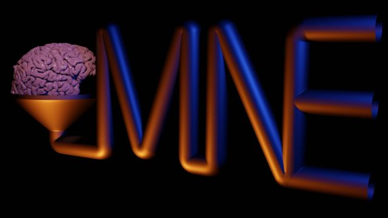

# mne_pipeline_hd
### A [MNE-Python](https://mne.tools/stable/index.html) Pipeline-GUI for MEG-Lab Heidelberg
###### inspired by: [Andersen L.M. 2018](https://doi.org/10.3389/fnins.2018.00006)

## Installation
1. Install MNE-python as instructed on the [website](https://www.martinos.org/mne/stable/install_mne_python.html),
I would recommend to install in a separate conda environment with:
`conda env create -n mne_p -f environment.yml`
2. `conda activate mne_p`
3. `pip install --upgrade https://github.com/marsipu/mne_pipeline_hd/zipball/main`

(or do `pip install -e --upgrade https://github.com/marsipu/mne_pipeline_hd/zipball/main`
when you are in a directory where you want the mne_pipeline_hd-scripts installed)

## Update

Just run `pip install --upgrade --force-reinstall https://github.com/marsipu/mne_pipeline_hd/zipball/main` again

## Start
Run `mne_pipeline_hd` in your mne_pipeline-environment (`conda activate mne_p`)

**or**

run \_\_main\_\_.py from the terminal or an IDE like PyCharm, VSCode, Atom, etc.

***When using the pipeline and its functions bear in mind that the pipeline is stil in development 
and the functions are partly still adjusted to my analysis!***

## Bug-Report/Feature-Request
Please report bugs on GitHub as an issue or to me (dev@earthman-music.de) directly.
And if you got ideas on how to improve the pipeline or some feature-requests,
you are welcome to open an issue too or send an e-mail (dev@earthman-music.de)

## Contribute and build your own functions/fix bugs

If you want to help me with the development and/or customize the pipeline to fit your needs, do it like this:

You need a [GitHub-Account](https://github.com/)
and should have [git](https://git-scm.com/book/en/v2/Getting-Started-Installing-Git) installed.

1. Fork this repository on GitHub
2. Move to the folder where you want to clone to
3. Clone **your forked repository** with git from a terminal: `git clone <url you get from the green clone-button from your forked repository on GitHub>`
4. Add upstream to git for updates: `git remote add upstream git://github.com/marsipu/mne_pipeline_hd.git`
5. Create a branch for changes: `git checkout -b <branch-name>`
6. Commit changes: `git commit --all `
7. Push changes to your forked repository on GitHub: `git push`
8. Make "New pull request" from your new feature branch

## Acknowledgments
This Pipeline is build on top of [MNE-Python](https://mne.tools/stable/index.html)
> A. Gramfort, M. Luessi, E. Larson, D. Engemann, D. Strohmeier, C. Brodbeck, L. Parkkonen, M. Hämäläinen,
> MNE software for processing MEG and EEG data, NeuroImage, Volume 86, 1 February 2014, Pages 446-460, ISSN 1053-8119,
> [DOI](https://doi.org/10.1016/j.neuroimage.2013.10.027)

It was inspired by a pipeline from [Lau M. Andersen](https://doi.org/10.3389/fnins.2018.00006)
> Andersen LM. Group Analysis in MNE-Python of Evoked Responses from a Tactile Stimulation Paradigm: A Pipeline for
> Reproducibility at Every Step of Processing, Going from Individual Sensor Space Representations to an across-Group
> Source Space Representation. Front Neurosci. 2018 Jan 22;12:6. doi: 10.3389/fnins.2018.00006. PMID: 29403349;
> PMCID: PMC5786561.

This program also integrates [autoreject](https://doi.org/10.1016/j.neuroimage.2017.06.030)
> Mainak Jas, Denis Engemann, Yousra Bekhti, Federico Raimondo, and Alexandre Gramfort. 2017.
> “Autoreject: Automated artifact rejection for MEG and EEG data”. NeuroImage, 159, 417-429.

Many ideas and basics for GUI-Programming where taken from [LearnPyQt](https://www.learnpyqt.com/) and numerous
stackoverflow-questions/solutions.
